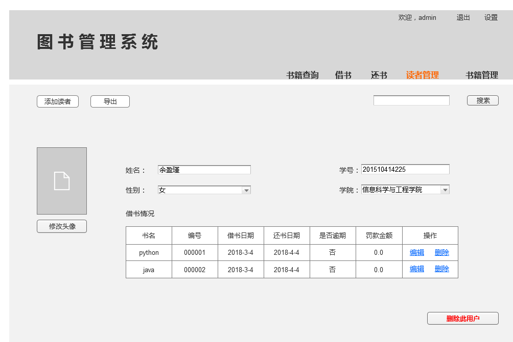

# 实验5:图书管理系统数据库设计与界面设计
姓名：余盈瑾<br>
班级：15软工2班<br>
学号：201510414225<br>

## 1.表数据设计
### 1.1图书表
字段|类型|主键/外键|能否为空|约束|说明
:---|:---|:--------|:-------|:---|:---
bookId|varchar(30)|主键|否
ISBN|varchar(40)| 外键|是
bookName|varchar(40)| |是
author|varchar(40)| |是
publisher|varchar(40)| |是
summary|varchar(200)| |是
price|float(20)| |是
cnum|int(100)| |是| |库存数量
orderNum|int(100)| |是| |已被预定的数目
loanNum|int(100)| |是| |已被借出去的数目
oddNum|int(100)| |是| |剩余数目

### 1.2预约表
字段|类型|主键/外键|能否为空|约束|说明
:---|:---|:--------|:-------|:---|:---
orderId|varchar(30)|主键|否
ISBN|varchar(40)| 外键|是
orserDate|date(40)| |是| |预定日期
author|varchar(40)| |是
num|int(50)| |是| |预定数量


### 1.3读者表
字段|类型|主键/外键|能否为空|约束|说明
:---|:---|:--------|:-------|:---|:---
readerId|varchar(30)|主键|否
readerName|varchar(40)|  |是
password|varchar(40)| |是
hasLoanNum|int(50)| |是| |已借数目
maxLoanNum|int(50)| |是| |可借最大数目
orderId|varchar(30)|外键|是

### 1.4借阅记录表
字段|类型|主键/外键|能否为空|约束|说明
:---|:---|:--------|:-------|:---|:---
id|int(20)|主键|否
readerId|varchar(30)|外键|是
bookId|varchar(30)|外键|是
loanDate|date(40)| |是
oddDays|int(30)| |是| |剩余天数

###  1.5罚款记录表
字段|类型|主键/外键|能否为空|约束|说明
:---|:---|:--------|:-------|:---|:---
id|int(20)|主键|否
readerId|varchar(30)|外键|是
bookId|varchar(30)|外键|是
overDays|int(30)| |是| |超过天数
fine|float(20)|  |是| |罚款金额

###  1.6图书管理员表
字段|类型|主键/外键|能否为空|约束|说明
:---|:---|:--------|:-------|:---|:---
managerId|varchar(30)|主键|否
managerName|varchar(40)|  |是
password|varchar(40)| |是

## 2.读者管理原型图
原型图如下：<br>
<br>
- 用例图参见：借书用例<br>
- 类图参见：借书类，读者类<br>
- 顺序图参见：借书顺序图<br>
- API接口如下：<br><br>
1.查询指定读者<br>
- 功能：获取读者信息
- 请求地址：http://localhost:8080/LibrarySystem/GET/student/id=1...
- 请求方法：GET
- 请求参数：readerId

参数名称|是否必填|说明
:---|:---|:---
readerId|是|用于验证并查找用户信息
method|是|固定为 “GET”

- 返回实例
```
{
    "code": 200,
    "data": {
            "photo": "??WExif",
            "name": "余盈瑾",
            "readerId": "20151051225",
            "sex": 1,
            "collg":5,
            "bookInfo": {
            书籍信息
            },
            
     },
    "info": "查找成功"
}
```
- 返回参数说明

参数名称|说明
:---|:---
code|状态码
data|读者信息
info|请求相应结果

2.修改指定用户<br>
- 功能：修改用户信息
- 请求地址：http://localhost:8080/LibrarySystem/GET/student/id=1...
- 请求方法：POST
- 请求参数：Reader

参数名称|是否必填|说明
:---|:---|:---
Reader|是|用户类对象
method|是|固定为 “GET”

- 返回实例
```
{
    "code": 200,
    "data": {
            "photo": "??WExif",
            "name": "余盈瑾",
            "readerId": "20151051225",
            "sex": 1,
            "collg":7,
            "bookInfo": {
            书籍信息
            },
            
     },
    "info": "修改成功"
}
```
- 返回参数说明

参数名称|说明
:---|:---
code|状态码
data|读者信息
info|请求相应结果

3.删除指定用户<br>
- 功能：删除用户信息
- 请求地址：http://localhost:8080/LibrarySystem/GET/student/id=1...
- 请求方法：GET
- 请求参数：readerId

参数名称|是否必填|说明
:---|:---|:---
readerId|是|用于验证并查找用户信息
method|是|固定为 “GET”

- 返回实例
```
{
    "code": 200,
    "data": {
            },
            
     },
    "info": "删除成功"
}
```
- 返回参数说明

参数名称|说明
:---|:---
code|状态码
data|读者信息
info|请求相应结果

4.添加用户<br>
- 功能：修改用户信息
- 请求地址：http://localhost:8080/LibrarySystem/GET/student/id=1...
- 请求方法：POST
- 请求参数：Reader

参数名称|是否必填|说明
:---|:---|:---
Reader|是|用户类对象
method|是|固定为 “GET”

- 返回实例
```
{
    "code": 200,
    "data": {
            "photo": "??WExif",
            "name": "余盈瑾",
            "readerId": "20151051225",
            "sex": 1,
            "collg":7,
            "bookInfo": {
            书籍信息
            },
     },
    "info": "添加成功"
}
```
- 返回参数说明

参数名称|说明
:---|:---
code|状态码
data|读者信息
info|请求相应结果
