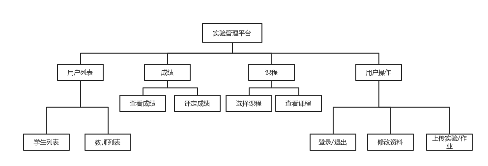
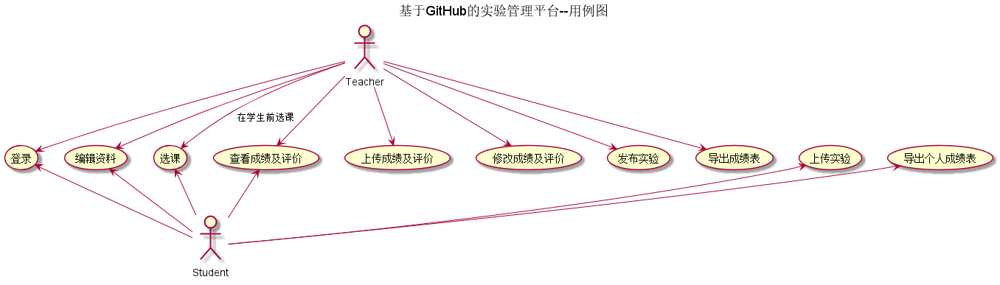
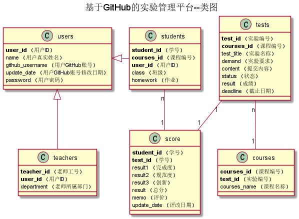

# 实验6(期末项目):基于GitHub的实验管理平台的分析与设计
姓名：余盈瑾 
班级：15软工2班 
学号：201510414225 

## 1.系统说明
这是一个实验成绩管理平台，因为每一学期每一门课程的实验都是很重要的一部分，是单独进行打分，但是没有一个专门的平台提供给老师和同学进行实验成绩的管理、查询。所以我们对实验管理平台进行了设计。
下面是功能上的一些简介：
- 是基于github的实验成绩管理系统，学生和老师的实验内容直接放在github上
- 学生功能是查询成绩、选择课程、修改资料
- 老师功能有上传成绩要求、选择课程、批改实验
- 方便老师管理、学生查询实验成绩

## 2.系统总体结构

## 3.系统用例图 [源码](puml/用例图.puml)

## 4.类设计图 [源码](puml/类图.puml)

## 5.数据库设计 
[参见数据库设计](数据库设计.md)

## 6.用例详情
- [登录用例](用例/登录.md)
- [学生列表](用例/学生列表用例.md)
- [查看成绩](用例/查看成绩.md)
- [上传实验](用例/上传实验.md)
- [上传成绩](用例/上传成绩.md)
- [发布实验](用例/发布实验.md)
- [编辑资料](用例/用户编辑资料.md)
- [选择课程](用例/选择课程.md)
- [删除学生](用例/删除学生.md)
- [其他流程活动图](用例/其他活动图.md)

## 7.界面设计
- [登录界面](https://Fhinee.github.io/is_analysis/tree/master/test6/ui/home.html)
- [上传实验](https://htmlpreview.github.io/？https://github.com/Fhinee/is_analysis/tree/master/test6/ui/上传实验.html)
- [修改信息](https://htmlpreview.github.io/？https://github.com/Fhinee/is_analysis/tree/master/test6/ui/修改信息.html)
- [教师发布实验](https://htmlpreview.github.io/？https://github.com/Fhinee/is_analysis/tree/master/test6/ui/发布实验.html)
- [学生列表](https://htmlpreview.github.io/？https://github.com/Fhinee/is_analysis/tree/master/test6/ui/学生列表.html)
- [教师打分中心](https://htmlpreview.github.io/？https://github.com/Fhinee/is_analysis/tree/master/test6/ui/打分中心.html)
- [打分列表](https://htmlpreview.github.io/？https://github.com/Fhinee/is_analysis/tree/master/test6/ui/打分列表.html)
- [提交实验界面](https://htmlpreview.github.io/？https://github.com/Fhinee/is_analysis/tree/master/test6/ui/提交界面.html)
- [查看成绩界面](https://htmlpreview.github.io/？https://github.com/Fhinee/is_analysis/tree/master/test6/ui/查看成绩.html)
- [课程列表](https://htmlpreview.github.io/？https://github.com/Fhinee/is_analysis/tree/master/test6/ui/课程列表.html)
- [课程详情页](https://htmlpreview.github.io/？https://github.com/Fhinee/is_analysis/tree/master/test6/ui/课程详情页.html)
