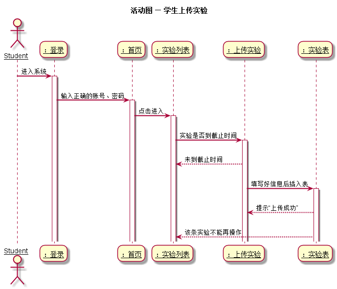
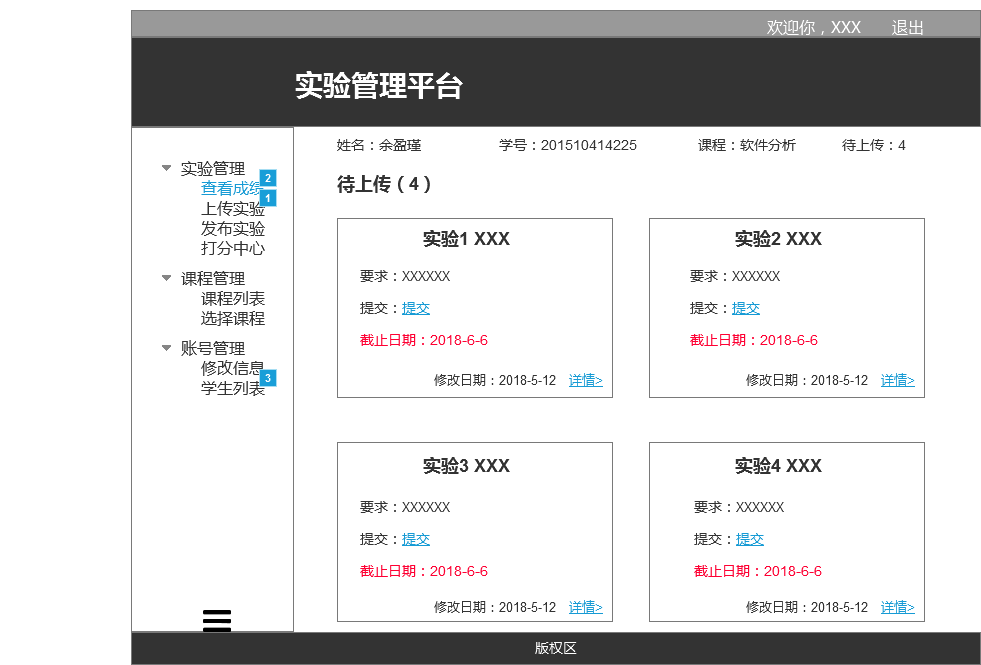
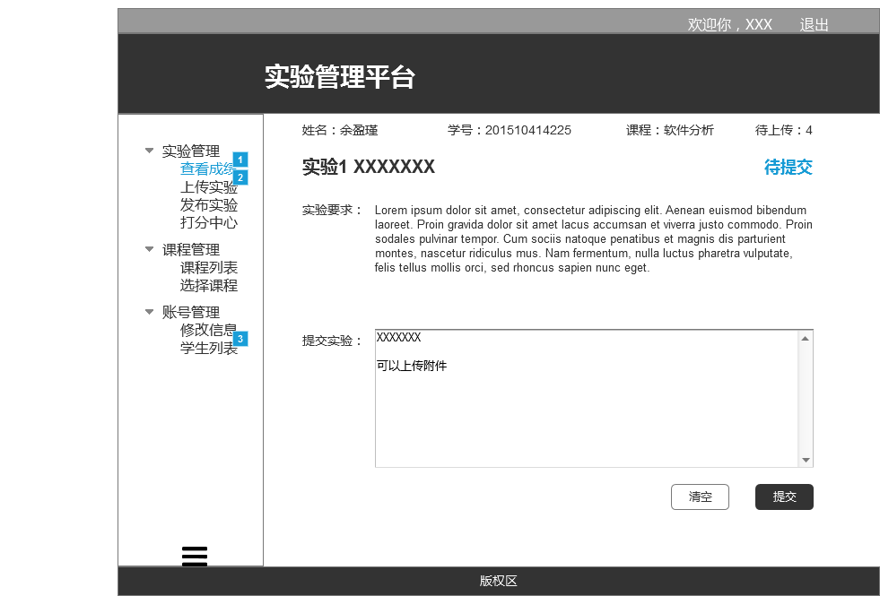

# 上传实验用例及接口说明 [首页](../README.md)

## 1. 用例规约

|用例名称|学生列表|
|-------|:-------------|
|功能|学生将需要提交的实验上交|
|参与者|学生|
|前置条件|以学生的角色登录|
|后置条件|等待老师打分|
|主事件流|1. 查看未提交的实验<br>2. 输入提交内容后提交<br>|
|备选事件流|超过截止日期的实验不能编辑|

## 2.业务流程 [源码](../puml/活动图/上传实验.puml)


## 3.页面设计
页面如下：


## 4.接口说明

 - 接口名：setHomework（设置学生成绩）
 - 权限：老师
 - API请求地址： 接口基本地址/v1/api/setHomework
 - 请求方式 ： POST
 - 请求实例
 ```
   {    "student_id":201510414225,   
       "test_id": 20,
       "content": 反正就是实验内容,
       "update_date": 2018-5-8,
   }
```
 - 请求参数说明：
    |参数名称|说明|
    |:---------:|:----------------|
    |student_id|学生学号|
    |test_id|实验编号|
    |content|实验内容|
    |update_date|修改实验最后一次时间|

- 返回实例
```
  {         
      "status": true,
      "info": null
  }
```
- 返回参数说明：

 |参数名称|说明|
 |:---------:|:---------------------------|
 |status|bool类型，true表示正确的返回，false表示有错误|
 |info|返回结果说明信息|
