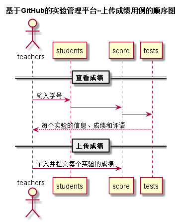
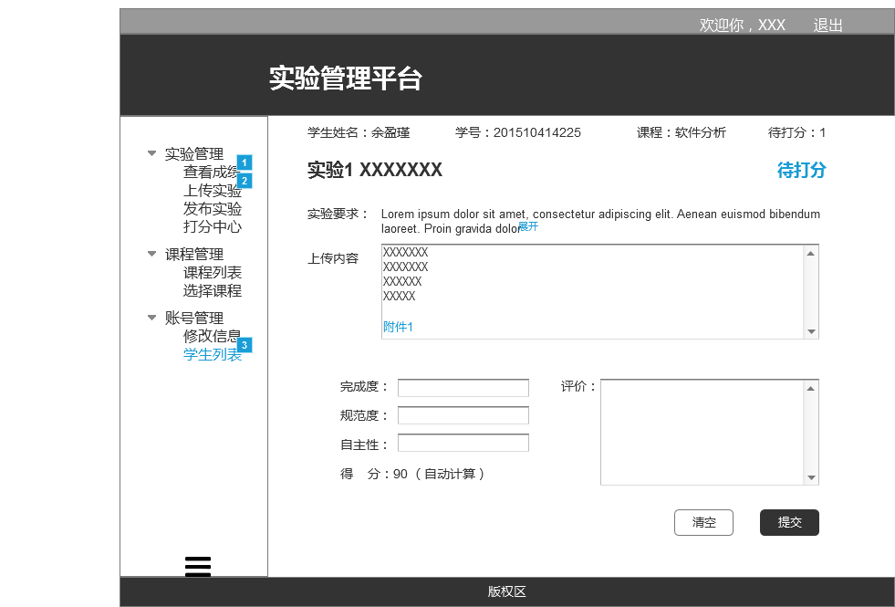

# 上传成绩用例及接口说明 [首页](../README.md)

## 1. 用例规约

|用例名称|学生列表|
|-------|:-------------|
|功能|老师给学生实验打分|
|参与者|老师|
|前置条件|以老师的角色登录|
|后置条件|评定成绩提交之后，系统自动设置成绩更新日期为当前日期，自动计算平均成绩|
|主事件流|1. 查看已有的成绩<br>2. 输入一个或者多个实验的成绩和评语<br>3. 提交<br>4. 系统存储实验成绩和评语<br>5. 系统自动计算平均成绩  |
|备选事件流| 成绩在0-100之间|

## 2.业务流程 [源码](../puml/顺序图/上传成绩.puml)


## 3.页面设计 
页面如下：

## 4.接口说明
- 接口名：getStudents（先获取学生列表）
- 权限：学生、老师，但老师可进行学生的增删改操作
- API请求地址： 接口基本地址/v1/api/getStudents
- 请求方式 ： GET
- 请求参数说明：无
- 返回实例
```
{
      "status": true,
      "info": null,
      "total": 120,
      "data": [
          {"COURSE":1
          "RESULT": "83.75,90,80,80,85,N",
          "GITHUB_USERNAME": "Fhinee",
          "STUDENT_ID": "201510315225",
          "CLASS": "软件(本)15-2",
          "NAME": "余盈瑾",
          "UPDATE_DATE": "2018-04-02 13:48:01"},
          {
          ...其他学生
          }
      ]
  }
```

- 返回参数说明：

  |参数名称|说明|
  |:---------:|:--------------------------------------------------------|
  |status|bool类型，true表示正确的返回，false表示有错误|
  |info|返回结果说明信息|
  |total|返回学生人数|
  |data|所有学生的数组|
  |COURSE|选择的课程|
  |RESULT|成绩的汇总|
  |GITHUB_USERNAME|GITHUB 用户名|
  |STUDENT_ID|学号|
  |CLASS|班级|
  |NAME|真实姓名|
  |UPDATE_DATE|GitHUB用户名修改日期|
  
 - 接口名：setOneStudentResult（设置学生成绩）
 - 权限：老师
 - API请求地址： 接口基本地址/v1/api/setOneStudentResult
 - 请求方式 ： POST
 - 请求参数说明：
 
    |参数名称|说明|
    |:---------:|:--------------------------------------------------------|
    |student_id|学生学号|
    |test_id|实验编号|
    |result1|完成度打分|
    |result2|规范度打分|
    |result3|创新打分|
    |result|成绩的汇总|
    |memo|评价|
    |UPDATE_DATE|GitHUB用户名修改日期|

- 返回实例
```
  {         
      "status": true,
      "info": null
  }
```
- 返回参数说明：

 |参数名称|说明|
 |:---------:|:--------------------------------------------------------|
 |status|bool类型，true表示正确的返回，false表示有错误|
 |info|返回结果说明信息|
