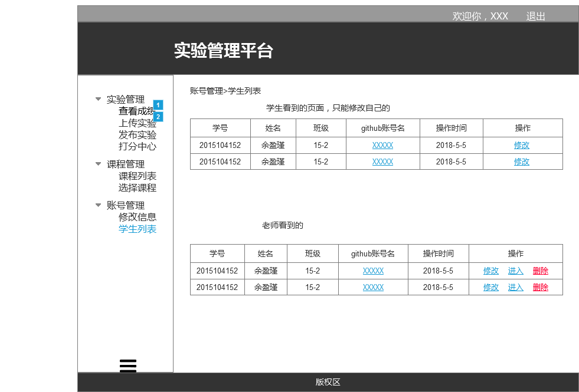

# 删除学生用例及接口说明 [返回](../README.md)
## 1. 用例规约

|用例名称|查看成绩|
|-------|:-------------|
|功能|老师删除学生信息|
|参与者|老师|
|前置条件|需要先登录|
|后置条件|删除后学生无法进入系统，学生列表页没有相关信息 |
|主事件流|1.进入系统，打开学生列表<br>2.选择要删除的学生，点击删除|
|备选事件流| |

## 2. 业务流程（顺序图） 
无


## 3.页面设计
页面如下：

## 4.接口说明
- 接口名：delStudent
- 功能：删除学生及先关信息
    
- 权限： 老师
    
- API请求地址：  接口基本地址/v1/api/delStudent

- 请求方式 ：POST

- 请求实例：
```
 {
      "student_id":1234,
  }
```     

  |参数名称|说明|
  |:---------:|:--------------------------------------------------------|      
  |student_id|学生学号|

    
- 返回实例：
```
  {         
      "status": true,
      "info": ok
  }
```
- 返回参数说明：

 |参数名称|说明|
 |:---------:|:--------------------------------------------------------|
 |status|bool类型，true表示正确的返回，false表示有错误|
 |info|ok说明删除成功|

