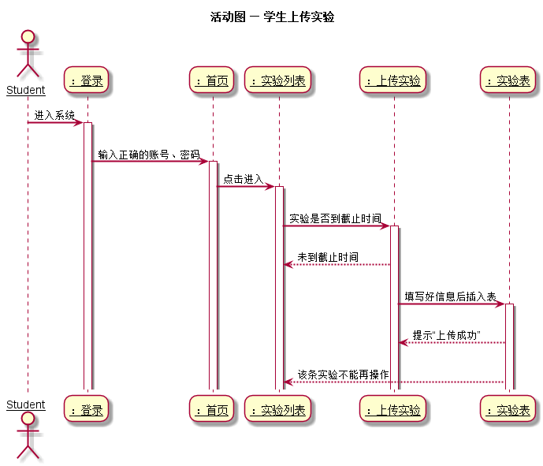
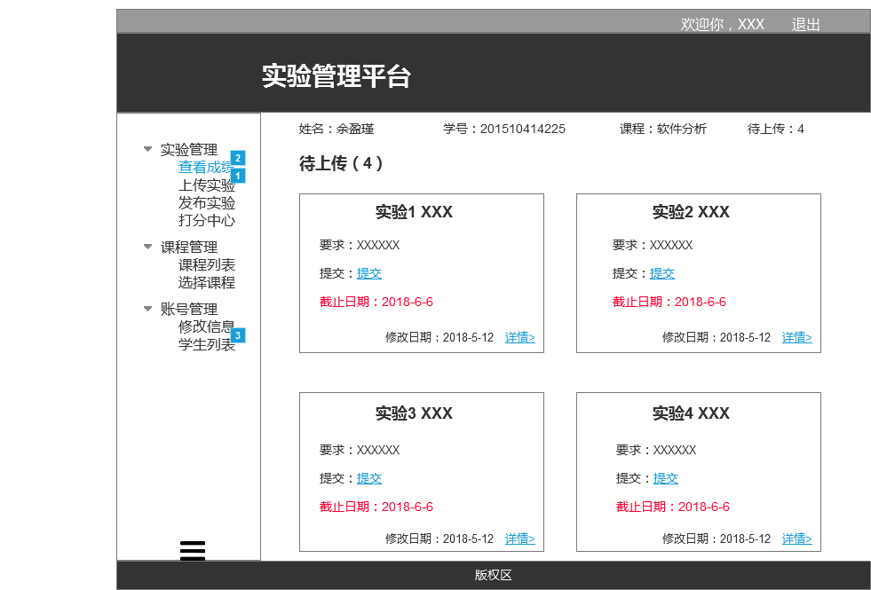

# 上传实验用例及接口说明 [首页](../README.md)

## 1. 用例规约

|用例名称|学生列表|
|-------|:-------------|
|功能|老师上传实验及要求|
|参与者|老师|
|前置条件|以老师的角色登录|
|后置条件|上传实验后，学生会看到有待交实验|
|主事件流|1. 上传后学生会有待交实验<br>2. 学生交后提交到老师处<br>3. 老师进行打分 |
|备选事件流| 按要求上传实验|

## 2.业务流程 [源码](../puml/活动图/上传实验.puml)


## 3.页面设计 
页面如下：

## 4.接口说明
- 接口名：setTest
- 权限：老师，上传实验
- API请求地址： 接口基本地址/v1/api/setTest
- 请求方式 ： POST
- 请求实例
```
  {         
      "teset_id": 20,
      "test_name": 我就是实验名称,
      "demand": 我就是实验要求,
      "deadline": 2018-8-5
  }
```
 - 请求参数说明：
 
 |参数名称|说明|
    |:---------:|:--------------------------------------------------------|
    |test_id|实验编号|
    |test_name|实验名称 |
    |demand|实验要求|
    |deadline|截止日期|

- 返回实例
```
  {         
      "status": true,
      "info": null
  }
```
- 返回参数说明：

 |参数名称|说明|
 |:---------:|:--------------------------------------------------------|
 |status|bool类型，true表示正确的返回，false表示有错误|
 |info|返回结果说明信息|