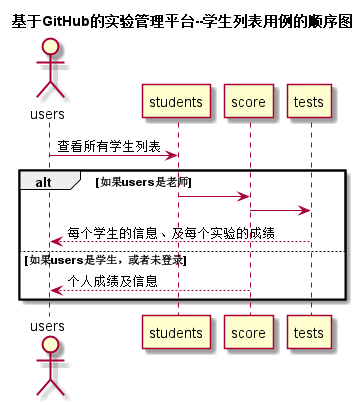

# 学生列表用例及接口说明 [首页](../README.md)

## 1. 用例规约

|用例名称|学生列表|
|-------|:-------------|
|功能|以表形式的显示出所有学生的信息|
|参与者|学生，老师|
|前置条件|学生，老师需要先登录|
|后置条件| |
|主事件流| |
|备选事件流| |

## 2.业务流程 [源码](../puml/顺序图/学生列表.puml)


## 3.页面设计
页面如下：

## 4.接口说明
- 接口名：getStudents
- 权限：学生、老师，但老师可进行学生的增删改操作
- API请求地址： 接口基本地址/v1/api/getStudents
- 请求方式 ： GET
- 请求参数说明：无
- 返回实例
```
{
      "status": true,
      "info": null,
      "total": 120,
      "data": [
          {"COURSE":1
          "RESULT": "83.75,90,80,80,85,N",
          "GITHUB_USERNAME": "Fhinee",
          "STUDENT_ID": "201510315225",
          "CLASS": "软件(本)15-2",
          "NAME": "余盈瑾",
          "UPDATE_DATE": "2018-04-02 13:48:01"},
          {
          ...其他学生
          }
      ]
  }
```

- 返回参数说明：

 |参数名称|说明|
  |:---------:|:--------------------------------------------------------|
  |status|bool类型，true表示正确的返回，false表示有错误|
  |info|返回结果说明信息|
  |total|返回学生人数|
  |data|所有学生的数组|
  |COURSE|选择的课程|
  |RESULT|成绩的汇总|
  |GITHUB_USERNAME|GITHUB 用户名|
  |STUDENT_ID|学号|
  |CLASS|班级|
  |NAME|真实姓名|
  |UPDATE_DATE|GitHUB用户名修改日期|