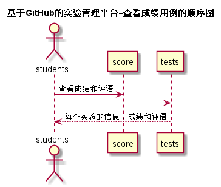
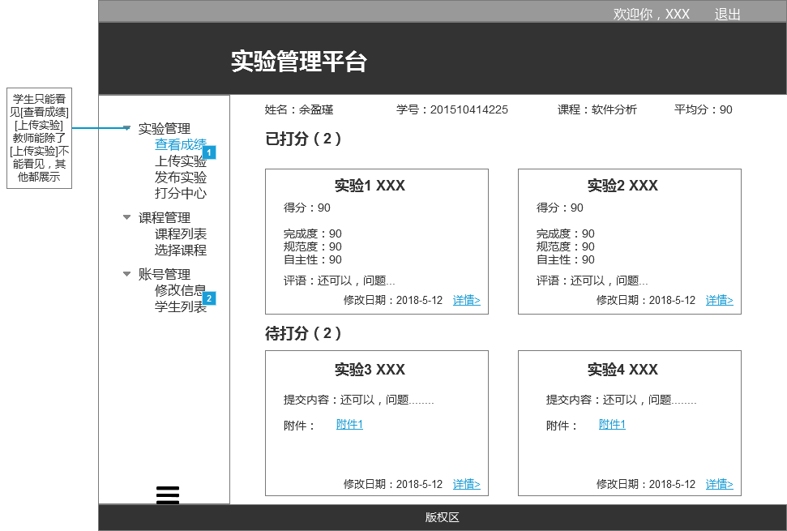

# 查看成绩用例及接口说明 [返回](../README.md)
## 1. 用例规约

|用例名称|查看成绩|
|-------|:-------------|
|功能|学生、老师查看每个实验的实验成绩及实验评价|
|参与者|学生，老师|
|前置条件|需要先登录|
|后置条件| |
|主事件流| |
|备选事件流| |

## 2. 业务流程（顺序图） [源码](../puml/顺序图/查看成绩.puml)

## 3.页面设计
页面如下：

## 4.接口说明
- 接口名：getOneStudent
- 功能：返回一个学生的所有实验成绩和实验评价
    
- 权限：
    学生：只能查看自己的成绩，即接口参数student_id必须等于登录学生的student_id
    老师：可以查看所有学生的成绩
    
- API请求地址： 
    接口基本地址/v1/api/getOneStudentResults/<student_id>

- 请求方式 ：
    GET

- 请求参数说明:        

  |参数名称|说明|
  |:---------:|:--------------------------------------------------------|      
  |student_id|学生的学号|
    
- 返回实例：

        {         
            "status": true,
            "info": null,    
            "github_username": "Fhinee",
            "student_id": "201510315225",
            "class": "软件(本)15-2",
            "name": "余盈瑾",
            "total": 6,
            "avgresult":90.5,       
            "data": [
                {
                "test_id":1,
                "web_exists": true, 
                "result": 91, 
                "memo":"完美",
                "update_date": "2018-04-02 13:48:01"
                }, 
                {
                ...其他实验
                }
            ] 
        }
 
- 返回参数说明：    
 
  |参数名称|说明|
  |:---------:|:--------------------------------------------------------|      
  |status|bool类型，true表示正确的返回，false表示有错误|
  |info|返回结果说明信息|
  |student_id|学号|
  |github_username|学生的gitHub用户名|
  |class|班级|
  |name|真实姓名|   
  |total|实验总数|
  |avgresult|实验平均成绩|   
  |data|所有实验的成绩和评语|
  |test_id|实验编号|
  |web_exists|本实验的GitHub网页是否存在|
  |result|本实验成绩，可以为空，为空表示没有批改，没有批改的实验不入平均成绩，为0分则要计入平均成绩，所以成绩为空和为0是不一样的。|
  |memo|本实验老师的评价，可以为空|
  |update_date|本实验老师的批改日期，可以为空|
