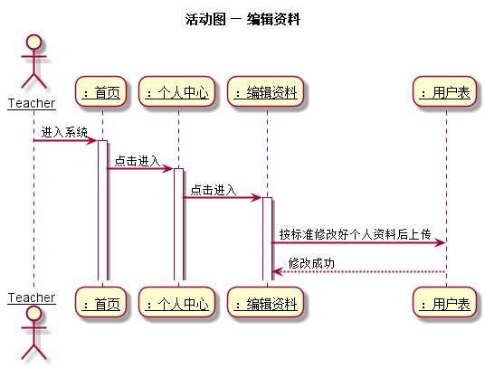

# 查看成绩用例及接口说明 [返回](../README.md)
## 1. 用例规约

|用例名称|查看成绩|
|-------|:-------------|
|功能|学生、老师对自己资料进行编辑|
|参与者|学生，老师|
|前置条件|需要先登录|
|后置条件| |
|主事件流|1.用户两次填写新密码<br>2.用户提交修改信息<br>3.系统存储修改后的密码|
|备选事件流| 用户输入两次密码一致|

## 2. 业务流程（顺序图） [源码](../puml/活动图/编辑资料.puml)



## 3.页面设计
页面如下：

## 4.接口说明
- 接口名：setInformation
- 功能：编辑用户的用户信息、密码
    
- 权限： 学生/老师：编辑自己资料
    
- API请求地址：  接口基本地址/v1/api/setInformation

- 请求方式 ：POST

- 请求实例：
```
 {
      "user_id":1234,
      "github_username":Fhinee
      "password":AF#W@#AAAASDF
  }
```     

  |参数名称|说明|
  |:---------:|:--------------------------------------------------------|      
  |user_id|用户编号|
  |github_username|github用户名|
  |password|用户密码|
    
- 返回实例：
```
  {         
      "status": true,
      "info": null
  }
```
- 返回参数说明：

 |参数名称|说明|
 |:---------:|:--------------------------------------------------------|
 |status|bool类型，true表示正确的返回，false表示有错误|
 |info|返回结果说明信息|

