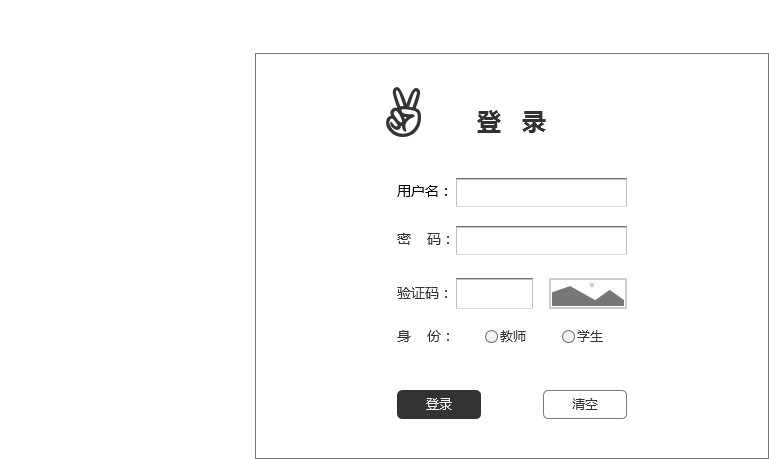

# 登录用例及接口说明 [首页](../README.md)

## 1. 用例规约

|用例名称|学生列表|
|-------|:-------------|
|功能|登录到系统|
|参与者|访客|
|前置条件||
|后置条件|登录成功后，跳转到主页|
|主事件流|1. 访客输入用户名和密码，选择用户类型 2.系统判断用户名，密码，用户类正确，允许登录|
|备选事件流| 登录表单条件限制|

## 2.业务流程 
暂无

## 3.页面设计
页面如下：

## 4.接口说明
- 功能：
    登录到平台。
    
- 权限：
    访客。    
    
- API请求地址： 
    接口基本地址/v1/api/login

- 请求方式 ：
    POST

- 请求实例：

        {
            "id":"21048329823",
            "password":"ABCDE",
            "type":"学生"
        }
        
- 请求参数说明:        

  |参数名称|说明|
  |:---------:|:--------------------------------------------------------|      
  |id|学生学号或者老师的工号，由type决定。|
  |password|用户的密码，不是原文，是加密后的字符串| 
  |type|用户类型，学生或者老师|
  
- 返回实例：

        { 
            "status": true,
            "info": null,    
        }
 
- 返回参数说明：    
 
  |参数名称|说明|
  |:---------:|:--------------------------------------------------------|      
  |status|bool类型，true表示正确的返回，false表示有错误|
  |info|返回结果说明信息|
