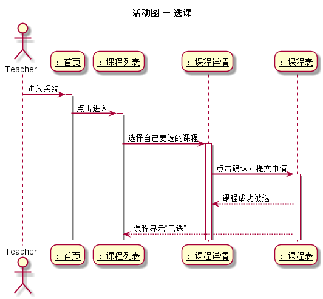
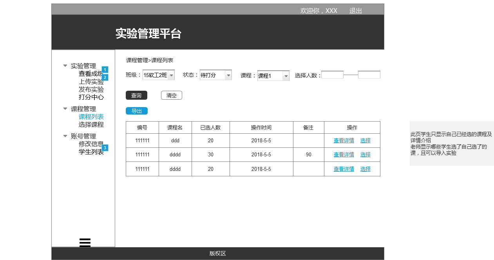
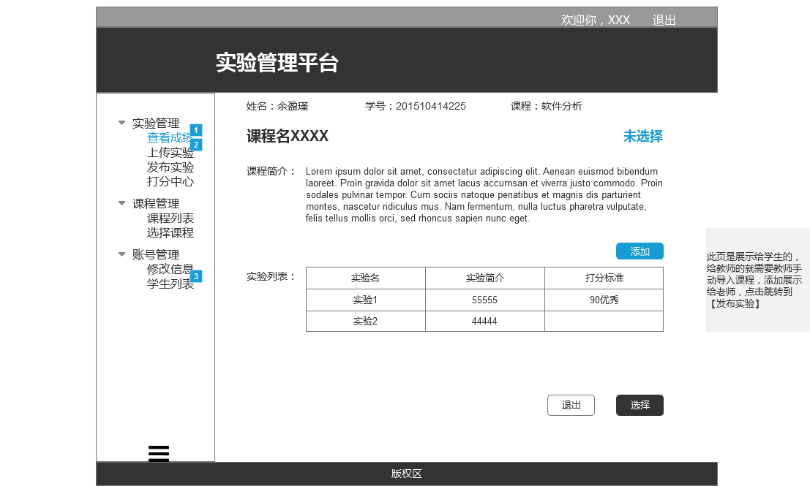

# 上传实验用例及接口说明 [首页](../README.md)

## 1. 用例规约

|用例名称|学生列表|
|-------|:-------------|
|功能|老师、同学选择课程|
|参与者|老师、学生|
|前置条件|登录上后，学生在老师选完课后进行选课|
|后置条件|老师选完后学生选|
|主事件流|1. 老师选课<br>2. 课程出现到学生的课程列表<br>3. 学生进行选课 |
|备选事件流| |

## 2.业务流程 [源码](../puml/活动图/选课.puml)


## 3.页面设计
页面如下：

## 4.接口说明
- 接口名：chooseCourse
- 权限：老师、学生
- API请求地址： 接口基本地址/v1/api/chooseCourse
- 请求方式 ： POST
- 请求实例
```
  {         
      "course_id": 20,
      "course_name": 软件分析,
      "update_time": 2018-8-5
  }
```
 - 请求参数说明：
 
 |参数名称|说明|
    |:---------:|:-------------------------------------------|
    |course_id|课程编号|
    |course_name|课程名称 |
    |update_time|操作日期|

- 返回实例
```
  {         
      "status": true,
      "info": null
  }
```
- 返回参数说明：

 |参数名称|说明|
 |:---------:|:--------------------------------------------------------|
 |status|bool类型，true表示正确的返回，false表示有错误|
 |info|返回结果说明信息|